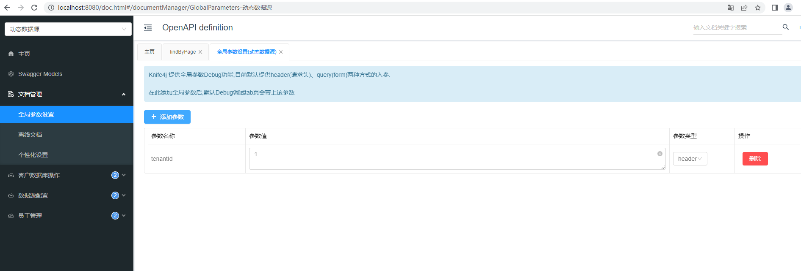
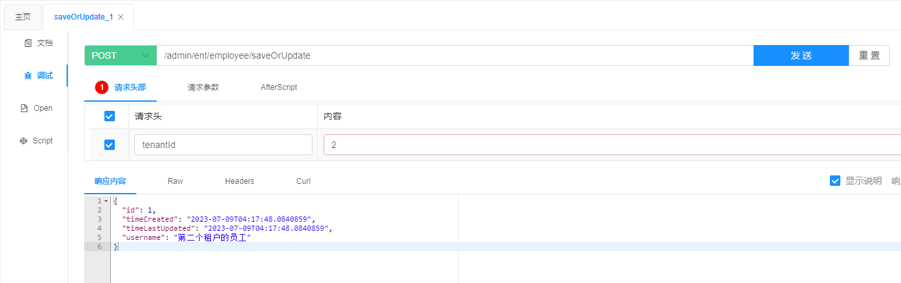
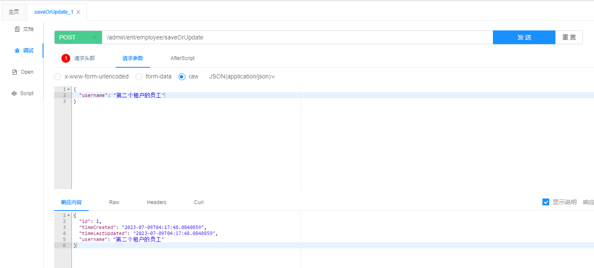

# Spring Boot + JPA 动态多数据源
## 这个项目能做什么
在不重启服务的情况下，通过在租户数据库表中，添加数据库的 driverClassName、url、username、password 配置，既可动态新增数据源
## 项目启动条件
|  框架   | 版本  |
|  ----  | ----  |
| Spring Boot  | 3.1 |
| JDK  | 20 |
| MySQL  | 8.0 |
## 演示功能
### 创建数据库及启动项目
+ 创建主数据库`create database main;`，把 application.yml 中的 spring.datasource 改成自己的
+ 分别创建两个租户数据库`create database tenant001; create database tenant002;`
+ 启动`DynamicDsApplication.java`  
  
+ 打开在线文档地址，[http://localhost:8080/doc.html](http://localhost:8080/doc.html)  
  
### 初始化租户数据库表结构
+ 分别录入租户1、租户2配置  
  
  
+ 测试刚才配置的租户1、租户2的数据库配置是否可用  
  
  
+ 给租户初始化数据库  
  
  
+ 查看表结构是否创建成功  
  
### 验证动态数据源
+ 因为程序是通过 header 里面的租户id(tenantId)来区分使用哪个租户库的，所以在“全局参数设置”中，添加 tenantId 参数  
  
+ 分别给租户1、租户2创建一条员工数据  
  
    
  
  
+ 查看租户表中数据  
  
+ 访问 [http://localhost:8080/druid/doc.html](http://localhost:8080/druid/doc.html)，admin/admin，查看数据源情况  
  
## 项目结构
```shell
.
└── src
    └── main
        ├── java
        │   └── cn
        │       └── bcf
        │           ├── DynamicDsApplication.java
        │           ├── conf
        │           │   ├── DruidConfig.java
        │           │   ├── HelpfulRunner.java
        │           │   ├── TenantHolder.java
        │           │   ├── WebConfig.java
        │           │   ├── main
        │           │   │   └── MainDbConfig.java
        │           │   └── tenant
        │           │       ├── TenantDataSource.java
        │           │       ├── TenantDataSourceFactory.java
        │           │       └── TenantDbConfig.java
        │           ├── controller
        │           │   ├── main
        │           │   │   ├── DataSourceConfController.java
        │           │   │   └── TenantDbUtilController.java
        │           │   └── tenant
        │           │       └── EmployeeController.java
        │           ├── dao
        │           │   ├── main
        │           │   │   └── DataSourceConfDao.java
        │           │   └── tenant
        │           │       └── EmployeeDao.java
        │           ├── entity
        │           │   ├── AbstractBaseEntity.java
        │           │   ├── main
        │           │   │   └── DataSourceConf.java
        │           │   └── tenant
        │           │       └── Employee.java
        │           └── interceptor
        │               └── TenantIdInterceptor.java
        └── resources
            └── application.yml
    ├── README.md
├── pom.xml
```
## 项目说明
### 准备知识
如果想看懂这个项目，需要开发者先明白如何在项目中配置多数据源，可参考 [https://www.cnblogs.com/ll409546297/p/10496346.html](https://www.cnblogs.com/ll409546297/p/10496346.html)，只有明白多数据源的配置原理，才能明白如何动态配置多数据源
### 原理概述
整个项目重要的地方只有两块，都在`cn.bcf.config`文件夹下
第一块是如何区分不同租户，这个地方是在 header 里面放置了 tenantId 参数，表示租户 id，然后再搭配拦截器`cn.bcf.interceptor.TenantIdInterceptor.java`和`cn.bcf.conf.TenantHolder.java`，对 tenantId 进行获取和会话存储
第二块是如何进行动态获取 DataSource，这个地方是重写了`javax.sql.DataSource`，具体实现在`cn.bcf.conf.tenant`文件夹下
## FAQ
### 租户数据库只能从数据库读取吗
目前实现中，只有数据库版本，如需从配置文件或者配置中心读取，只需要对 `TenantDataSourceFactory.java` 中的配置获取方式进行改造，很简单的
### 这个项目能直接应用生产吗
我这里只是对思路进行了实现，生产的话需要自己做下适配及改造
### 持久层框架必须使用 Spring Data JPA 吗
目前只针对 JPA 做了实现，如果需要使用 Mybatis，需要自己对项目做下改造，思路其实是一样的
